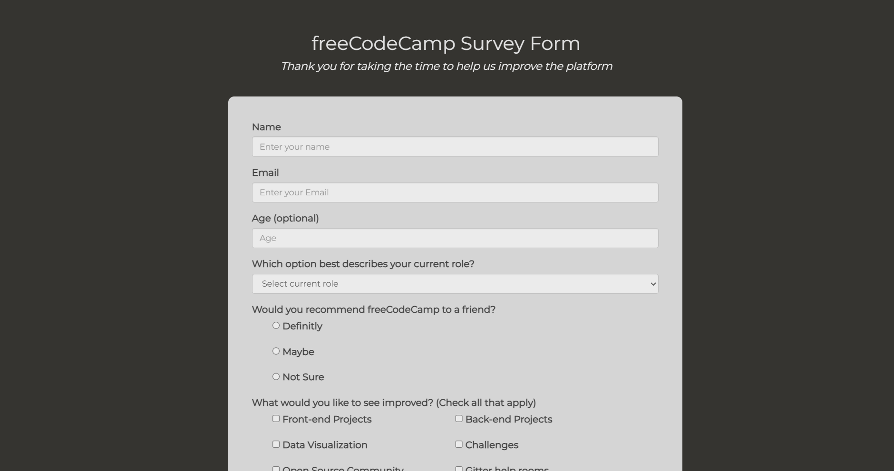

# Survey Form

## Project Overview
This project is part of the Responsive Web Design certification by freeCodeCamp. The goal of this project is to build a survey form using HTML and CSS, ensuring responsiveness across devices. The form collects user information and includes various form input types such as text fields, radio buttons, checkboxes, and a submit button.

## Live Demo
[Survey Form](https://razeen-shaikh.github.io/survey-form/)

## Features
- A clean, user-friendly form interface.
- Various input elements: text fields, radio buttons, checkboxes, dropdowns.
- Form validation to ensure required fields are filled.
- Responsive design that adapts to different screen sizes.
- Stylish form with basic CSS styling.

## Technologies Used
- HTML for structure
- CSS for styling and layout
- Responsive Web Design techniques (e.g., media queries)

## Screenshots


## How to Use
- Clone the repository:
    ```bash
    git clone https://github.com/your-username/survey-form.git
    ```
- Open the index.html file in a browser to view the form.
- Fill out the survey form with the required information and submit.

## Learning Objectives
- Understand the basics of HTML form elements.
- Practice using CSS for layout and design.
- Implement responsive design with CSS to ensure the form works on all screen sizes.
- Learn form validation techniques to enhance user experience.

## Challenges Overcome
- Ensuring all input elements are styled consistently.
- Creating a responsive layout that adapts seamlessly to different screen sizes.
- Implementing form validation using HTML attributes like required, minlength, and pattern.